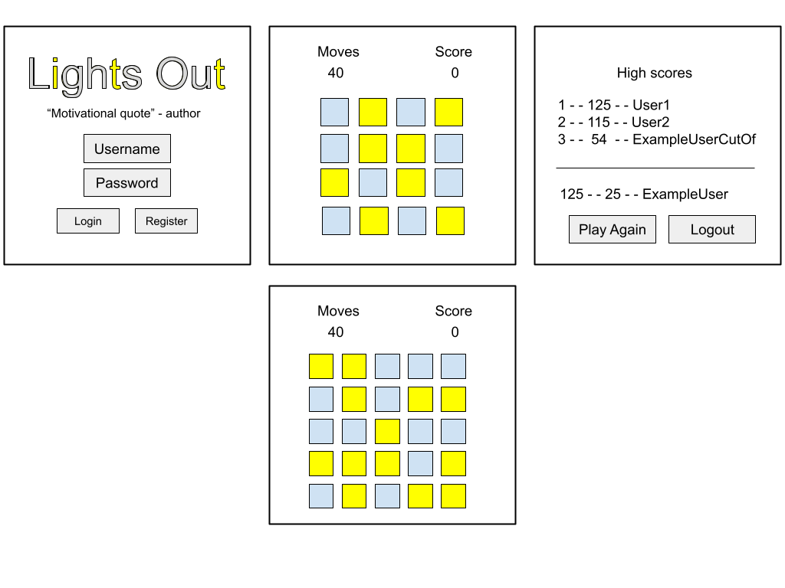
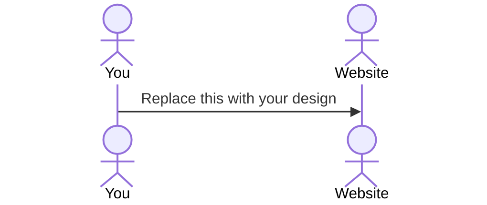

# Lights Out Evelution

[My Notes](notes.md)

This will be a simple tribute to the 1995 puzzle game Lights out. It the game you have a grid with mutiple squares some of them being on and others being off. You are tasked to turn all of the lights off.

> [!NOTE]
> This is a template for your startup application. You must modify this `README.md` file for each phase of your development. You only need to fill in the section for each deliverable when that deliverable is submitted in Canvas. Without completing the section for a deliverable, the TA will not know what to look for when grading your submission. Feel free to add additional information to each deliverable description, but make sure you at least have the list of rubric items and a description of what you did for each item.

> [!NOTE]
> If you are not familiar with Markdown then you should review the [documentation](https://docs.github.com/en/get-started/writing-on-github/getting-started-with-writing-and-formatting-on-github/basic-writing-and-formatting-syntax) before continuing.

## 🚀 Specification Deliverable

> [!NOTE]
> Fill in this sections as the submission artifact for this deliverable. You can refer to this [example](https://github.com/webprogramming260/startup-example/blob/main/README.md) for inspiration.

For this deliverable I did the following. I checked the box `[x]` and added a description for things I completed.

- [x] Proper use of Markdown
- [x] A concise and compelling elevator pitch
- [x] Description of key features
- [x] Description of how you will use each technology
- [x] One or more rough sketches of your application. Images must be embedded in this file using Markdown image references.

### Elevator pitch

Do you ever get tired of all the new games with all their bells and wistles? Do you ever just want to go back to the basics? Well Lights Out Evelution is just what you need. Lights Out Evelution is a simple throwback to the 1995 electronic puzzle game. You get the familiarity of the original game with a all new and improved progressive game. You can challenge your friends and climb the leaderboard.

### Design

Lorem ipsum dolor sit amet, consectetur adipiscing elit, sed do eiusmod tempor incididunt ut labore et dolore magna aliqua. Ut enim ad minim veniam, quis nostrud exercitation ullamco laboris nisi ut aliquip ex ea commodo consequat. Duis aute irure dolor in reprehenderit in voluptate velit esse cillum dolore eu fugiat nulla pariatur. Excepteur sint occaecat cupidatat non proident, sunt in culpa qui officia deserunt mollit anim id est laborum.

### Key features

- Login, register
- Play by clicking on squares, colors change for itself and adjacent squares
- Receive notifications/updates for other player's scores.
- Look at highscores and rank
- Play again or logout

### Technologies

I am going to use the required technologies in the following ways.

- **HTML** - Displays four different pages. These pages include a login/register page, a gameplay page and a page for the leaderboard.
- **CSS** - Transitions from level to level. Button pressing.
- **React** - Login/register , advancement through the game, play again
- **Service** - Endpoints for user authentication, scores and rank. Third party service to display motivational quotes on the home page.
- **DB/Login** - Stores scores/rank and userdata.
- **WebSocket** - Broadcast users score along with name and current rank.

## 🚀 AWS deliverable

For this deliverable I did the following. I checked the box `[x]` and added a description for things I completed.

- [x] **Server deployed and accessible with custom domain name** - [My server link](https://yourdomainnamehere.click).

## 🚀 HTML deliverable

For this deliverable I did the following. I checked the box `[x]` and added a description for things I completed.

- [x] **HTML pages** - I have three working HTML pages
- [x] **Proper HTML element usage** - I used proper use of HTML to implement all three pages of my code
- [x] **Links** - I added links between each of my pages and to this github page.
- [x] **Text** - Text displayed on buttons and on the about page.
- [x] **3rd party API placeholder** - On the main page there is a placeholder for the 3rd party heckler.
- [x] **Images** - Uses an image in the icon and image showing the original lights out game on the about page.
- [x] **Login placeholder** - index.html has a space to login.
- [x] **DB data placeholder** - Scores are to be displayed on the score page.
- [x] **WebSocket placeholder** - There is a space for the notifications inside of the play page.

## 🚀 CSS deliverable

For this deliverable I did the following. I checked the box `[x]` and added a description for things I completed.

- [x] **Header, footer, and main content body** - I added CSS to format my header to display properly with my title and tabs, I made the body and footer display using css as well.
- [x] **Navigation elements** - Navigation elements look good and still work.
- [x] **Responsive to window resizing** - The text size changes with most sizes and when it doesn't it wraps properly and correctly. The Game Board also changes size.
- [x] **Application elements** - The elements of the game light up when you hover over them and the boxes for score and level are each formated. The give up button at the bottom is as well.
- [x] **Application text content** - The text paragraph on the about page wraps properly and displays around the image.
- [x] **Application images** - The Image on the about page displays properly and the text wraps around it.

## 🚀 React part 1: Routing deliverable

For this deliverable I did the following. I checked the box `[x]` and added a description for things I completed.

- [x] **Bundled using Vite** - Vite installed and used for react components
- [x] **Components** - Header, footer and pages components created
- [x] **Router** - Routing between login, play, about and scores components.

## 🚀 React part 2: Reactivity

For this deliverable I did the following. I checked the box `[x]` and added a description for things I completed.

- [x] **All functionality implemented or mocked out** - Lights out game is now playable and scores update properly.
- [x] **Hooks** - Hooks used in multiple areas, most used is in the game implementation.

## 🚀 Service deliverable

For this deliverable I did the following. I checked the box `[x]` and added a description for things I completed.

- [ ] **Node.js/Express HTTP service** - I did not complete this part of the deliverable.
- [ ] **Static middleware for frontend** - I did not complete this part of the deliverable.
- [ ] **Calls to third party endpoints** - I did not complete this part of the deliverable.
- [ ] **Backend service endpoints** - I did not complete this part of the deliverable.
- [ ] **Frontend calls service endpoints** - I did not complete this part of the deliverable.

## 🚀 DB/Login deliverable

For this deliverable I did the following. I checked the box `[x]` and added a description for things I completed.

- [ ] **User registration** - I did not complete this part of the deliverable.
- [ ] **User login and logout** - I did not complete this part of the deliverable.
- [ ] **Stores data in MongoDB** - I did not complete this part of the deliverable.
- [ ] **Stores credentials in MongoDB** - I did not complete this part of the deliverable.
- [ ] **Restricts functionality based on authentication** - I did not complete this part of the deliverable.

## 🚀 WebSocket deliverable

For this deliverable I did the following. I checked the box `[x]` and added a description for things I completed.

- [ ] **Backend listens for WebSocket connection** - I did not complete this part of the deliverable.
- [ ] **Frontend makes WebSocket connection** - I did not complete this part of the deliverable.
- [ ] **Data sent over WebSocket connection** - I did not complete this part of the deliverable.
- [ ] **WebSocket data displayed** - I did not complete this part of the deliverable.
- [ ] **Application is fully functional** - I did not complete this part of the deliverable.
